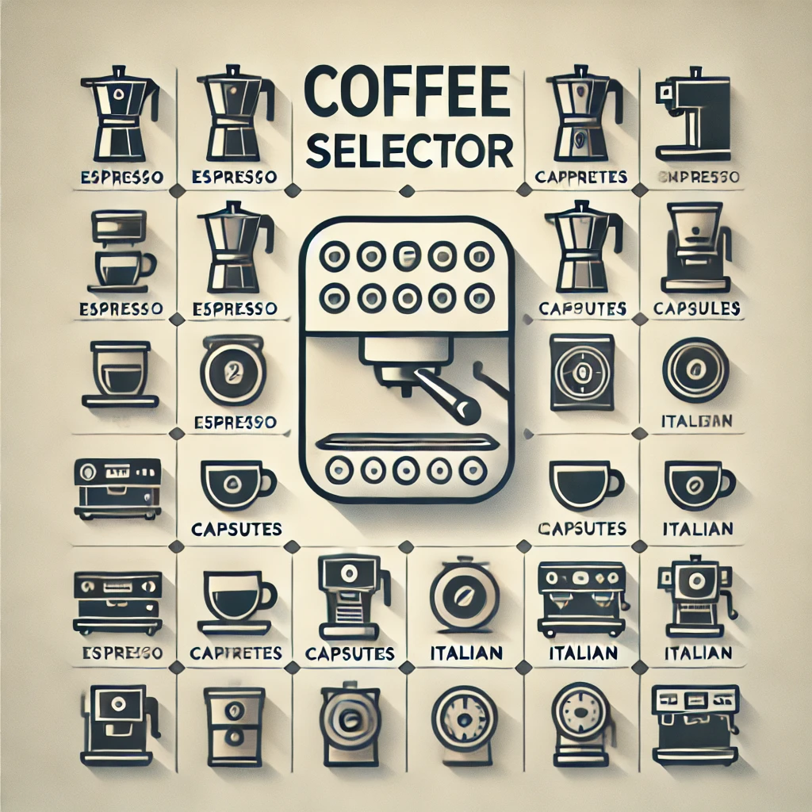
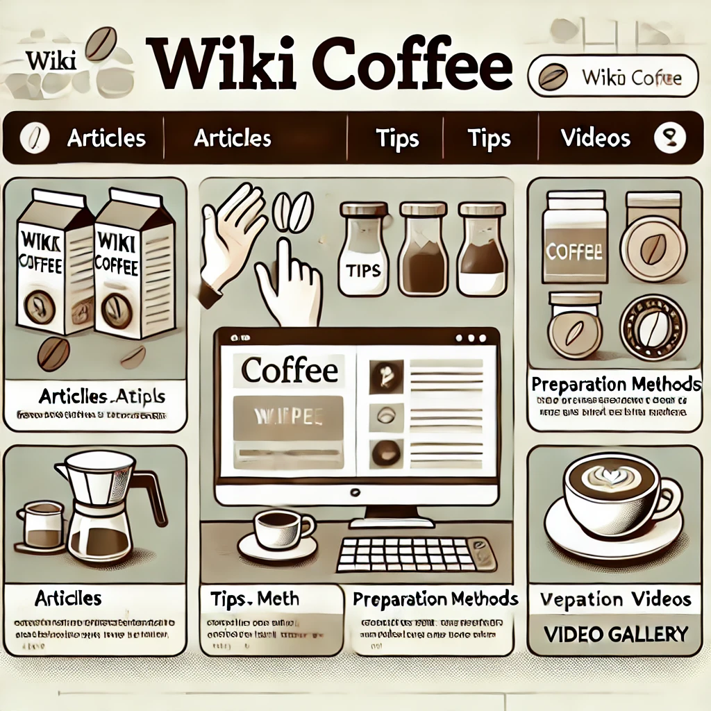

# Iron Coffee Lovers Web App ☕️

## Description

Welcome to **Iron Coffee Lovers Web App**, a web application dedicated to coffee lovers. Here you can find coffee recommendations based on your machine, preparation tips, instructional videos, and much more.

## Project Structure

This project is organized modularly to facilitate maintenance and scalability. Below is a detailed structure and function of each component.

### Main Components

- **Header**
  - **Header.jsx**: Renders the website's# Iron Coffee Lovers Web App ☕️

## Description

Welcome to **Iron Coffee Lovers Web App**, a web application dedicated to coffee lovers. Here you can find coffee recommendations based on your machine, preparation tips, instructional videos, and much more.

## Project Structure

This project is organized modularly to facilitate maintenance and scalability. Below is a detailed structure and function of each component.

### Main Components

- **Header**
  - **Header.jsx**: Renders the website's header with the logo and main navigation.

- **Navbar**
  - **Navbar.jsx**: Navigation bar with links to the different pages of the application.

- **Footer**
  - **Footer.jsx**: Footer with contact links and terms of service.

- **Hero**
  - **Hero.jsx**: Hero section on the main page with a featured image or video.

### CoffeeSelector

- **CoffeeSelector.jsx**: Main component for the coffee selector.
- **CoffeeForm.jsx**: Form for users to select their type of coffee machine.
- **CoffeeResults.jsx**: Displays the recommendations based on the user's selection.

### WikiCoffee

- **CoffeeCollection.jsx**: Displays a collection of articles about different types of coffee.
- **TipsSection.jsx**: Provides coffee tips, such as storage and preparation.
- **PreparationMethods.jsx**: Shows different coffee preparation methods with details.
- **VideoGallery.jsx**: Gallery of coffee-related videos, including tutorials and reviews.
- **WikiCoffee.jsx**: Main component that combines all elements of the WikiCoffee section.

### CoffeePot

- **CoffeePotCard.jsx**: Individual card to display information about a coffee pot.
- **CoffeePotList.jsx**: List of all available coffee pots.
- **AddNewCoffeePotForm.jsx**: Form to add a new coffee pot.
- **EditCoffeePotForm.jsx**: Form to edit an existing coffee pot.
- **DeleteCoffeePotForm.jsx**: Form to delete a coffee pot.

### Coffee

- **CoffeeCard.jsx**: Individual card to display information about a coffee.
- **CoffeeList.jsx**: List of all available coffees.
- **AddNewCoffeeForm.jsx**: Form to add a new coffee.
- **EditCoffeeForm.jsx**: Form to edit an existing coffee.
- **DeleteCoffeeForm.jsx**: Form to delete a coffee.

### Shared Components

- **Button.jsx**: Reusable button component.
- **Select.jsx**: Reusable select component.
- **Input.jsx**: Reusable input text component.
- **Carousel.jsx**: Component to create carousels of images or content.
- **Placeholders.jsx**: Placeholders while content is loading.
- **Spinner.jsx**: Loading spinners.
- **WarningDeleteAdvice.jsx**: Warnings and advice before performing a delete action.

### Pages

- **HomePage.jsx**: Main page of the application.
- **CoffeeSelectorPage.jsx**: Page dedicated to the coffee selector.
- **WikiCoffeePage.jsx**: WikiCoffee page with tips, preparations, videos, etc.
- **AboutPage.jsx**: Page about the company or project.
- **ErrorPage.jsx**: Error page for non-found routes.
- **CoffeeDetailsPage.jsx**: Page showing details of a specific coffee.
- **CoffeeResultPage.jsx**: Page showing the coffee recommendations based on the selected coffee pot.
- **AdminPage.jsx**: Admin page for managing the application.
- **AdminEditList.jsx**: Page for editing the list of coffees and coffee pots.
- **EditCoffeePage.jsx**: Page for editing an existing coffee.
- **EditCoffeePotPage.jsx**: Page for editing an existing coffee pot.

### Assets

- **assets/images/**: Folder for images used in the application.
- **assets/styles/**: Folder for CSS files.
  - **main.css**: Global styles.
  - **CoffeeSelector.css**: Specific styles for the coffee selector.
  - **WikiCoffee.css**: Specific styles for the WikiCoffee section.

## Installation

To run this project on your local machine:

1. Clone this repository: `git clone https://github.com/your-username/iron-coffee-lovers-web-app.git`
2. Navigate to the project directory: `cd iron-coffee-lovers-web-app`
3. Install dependencies: `npm install`
4. Run the application: `npm start`

## Contributing

Contributions are welcome. Please open an issue or pull request to discuss any changes you would like to make.

## License

This project is licensed under the MIT License.
 header with the logo and main navigation.

- **Navbar**
  - **Navbar.jsx**: Navigation bar with links to the different pages of the application.

- **Footer**
  - **Footer.jsx**: Footer with contact links and terms of service.

- **Hero**
  - **Hero.jsx**: Hero section on the main page with a featured image or video.

### CoffeeSelector

- **CoffeeSelector.jsx**: Main component for the coffee selector.
- **CoffeeForm.jsx**: Form for users to select their type of coffee machine.
- **CoffeeResults.jsx**: Displays the recommendations based on the user's selection.

### WikiCoffee

- **CoffeeCollection.jsx**: Displays a collection of articles about different types of coffee.
- **TipsSection.jsx**: Provides coffee tips, such as storage and preparation.
- **PreparationMethods.jsx**: Shows different coffee preparation methods with details.
- **VideoGallery.jsx**: Gallery of coffee-related videos, including tutorials and reviews.
- **WikiCoffee.jsx**: Main component that combines all elements of the WikiCoffee section.

### CoffeePot

- **CoffeePotCard.jsx**: Individual card to display information about a coffee pot.
- **CoffeePotList.jsx**: List of all available coffee pots.
- **AddNewCoffeePotForm.jsx**: Form to add a new coffee pot.
- **EditCoffeePotForm.jsx**: Form to edit an existing coffee pot.
- **DeleteCoffeePotForm.jsx**: Form to delete a coffee pot.

### Coffee

- **CoffeeCard.jsx**: Individual card to display information about a coffee.
- **CoffeeList.jsx**: List of all available coffees.
- **AddNewCoffeeForm.jsx**: Form to add a new coffee.
- **EditCoffeeForm.jsx**: Form to edit an existing coffee.
- **DeleteCoffeeForm.jsx**: Form to delete a coffee.

### Shared Components

- **Button.jsx**: Reusable button component.
- **Select.jsx**: Reusable select component.
- **Input.jsx**: Reusable input text component.
- **Carousel.jsx**: Component to create carousels of images or content.
- **Placeholders.jsx**: Placeholders while content is loading.
- **Spinner.jsx**: Loading spinners.
- **WarningDeleteAdvice.jsx**: Warnings and advice before performing a delete action.

### Pages

- **HomePage.jsx**: Main page of the application.
- **CoffeePage.jsx**: Page dedicated to the coffee selector.
- **WikiCoffeePage.jsx**: WikiCoffee page with tips, preparations, videos, etc.
- **AboutPage.jsx**: Page about the company or project.
- **ErrorPage.jsx**: Error page for non-found routes.

### Assets

- **assets/images/**: Folder for images used in the application.
- **assets/styles/**: Folder for CSS files.
  - **main.css**: Global styles.
  - **CoffeeSelector.css**: Specific styles for the coffee selector.
  - **WikiCoffee.css**: Specific styles for the WikiCoffee section.

## Installation

To run this project on your local machine:

1. Clone this repository: `git clone https://github.com/your-username/iron-coffee-lovers-web-app.git`
2. Navigate to the project directory: `cd iron-coffee-lovers-web-app`
3. Install dependencies: `npm install`
4. Run the application: `npm start`

## Contributing

Contributions are welcome. Please open an issue or pull request to discuss any changes you would like to make.

## License

This project is licensed under the MIT License.
